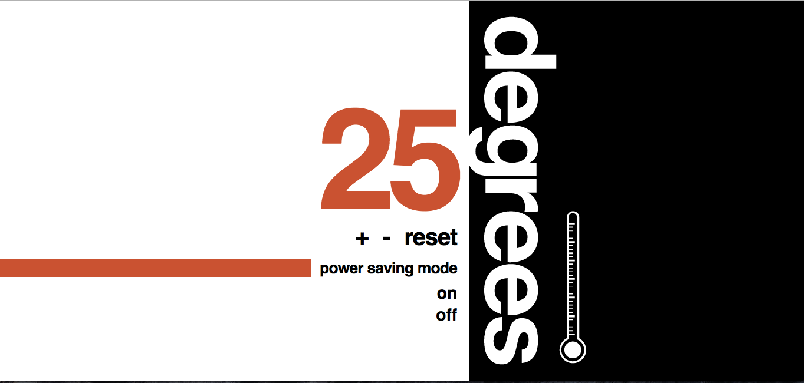

# Thermostat

### Task

Here's the [specification](./specification.md) to build the business logic to model a simple thermostat. You'll then hook it up to a dynamic visual interface using jQuery - all within the browser. Finally, you'll use fetch data from external sources and display them on the page - again, all using JS.

## Steps

* [Thermostat: business logic](business-logic.md)
* [Thermostat: interface](interface.md)
* [Thermostat: jQuery](jquery.md)
* [Thermostat: APIs](apis.md)
* [Thermostat: styling](styling.md)

## The Count project

The [Count](https://github.com/dearshrewdwit/count) project is a tiny, model full stack web app.  It exemplifies:

* Making Ajax requests.
* Testing frontend code.
* Separating frontend concerns using a component approach.

It's very worthwhile spending time investigating and playing with the code in this project to understand how it works.

## Specification

- Thermostat starts at 20 degrees
- You can increase the temp with the up button
- You can decrease the temp with the down button
- The minimum temperature is 10 degrees
- If power saving mode is on, the maximum temperature is 25 degrees
- If power saving mode is off, the maximum temperature is 32 degrees
- Power saving mode is on by default
- You can reset the temperature to 20 by hitting  the reset button
- The thermostat should colour the display based on energy usage - < 18 is green, < 25 is yellow, otherwise red

## Domain model

| Objects | Properties | Messages | Context | Output|
| ----- | ----- | ------ | ----- |------ |
| Thermostat | Int | | Starts at 20 | Int |
|  | Int | Increase() |  Increases the temperature | Int |
|  | Int | Decrease() |  Decreases the temperature | Int |
|  | | | Cant go lower than 10 | |
|  | | powerSavingMode() | If on max temp is 25| |
|  | | | If off max temp is 32 | |
|  | | | On by default | |
|  | | Reset |  Resets temperature to 20 | |